# TrustGrid

**Peer-to-peer marketplace trust-and-safety control plane.**

TrustGrid is a Java/Spring Boot backend that decides whether marketplace participants can safely transact, under what limits, with what evidence, with what risk, and with what reputation impact.

It is not a generic marketplace CRUD app.

It is a backend control plane for marketplace trust, safety, fraud, reputation, disputes, evidence, policy, operations, abuse response, and trust-aware marketplace eligibility.

---

## Killer one-liner

> TrustGrid decides whether strangers can safely transact, under what limits, with what evidence, with what risk, and with what reputation impact.

---

## Why this project exists

Peer-to-peer marketplaces are difficult because the platform is not just matching buyers and sellers.

The platform must decide:

* who can publish listings
* who can accept work
* which listings are safe to show
* when evidence is required
* when users need verification
* when a transaction should be blocked
* when a review should count less
* when a dispute should affect reputation
* when a participant should be restricted
* when an abuse pattern should become an incident
* when a guarantee decision should recommend a payment-boundary action
* when moderators need to intervene
* when a trust decision can be safely reversed

TrustGrid models that control-plane layer.

The goal is to prove senior/staff-level backend design around trust, fraud, safety, state machines, replay, auditability, consistency, policy, operations, and failure handling.

---

## What TrustGrid is

TrustGrid is a backend for a peer-to-peer marketplace where participants can:

* offer services
* sell second-hand items
* post errands
* post shopping requests
* accept marketplace work
* build reputation
* receive reviews
* provide evidence
* open disputes
* appeal restrictions
* recover trust after enforcement

The system evaluates whether those actions are safe.

It combines:

* participant trust state
* verification status
* capabilities
* restrictions
* listing risk
* transaction history
* evidence quality
* dispute outcomes
* review/reputation signals
* fraud/risk decisions
* policy versions
* operational context
* campaign/abuse signals

---

## What TrustGrid is not

TrustGrid intentionally does **not** implement:

* real payment movement
* balances
* settlement
* fund-holding execution
* real refunds
* real payouts
* real bank/provider integrations
* real identity document verification
* real KYC
* real OCR
* real AI moderation
* real ML fraud models
* frontend marketplace UI
* production auth/RBAC
* cloud deployment/IaC

TrustGrid may recommend that a refund, payout hold, or funds release should be requested, but it does not execute money movement.

That boundary keeps TrustGrid focused on marketplace trust-and-safety decisions.

---

## Tech stack

* Java 21
* Spring Boot 3.5.x
* Maven / Maven Wrapper
* PostgreSQL
* Flyway
* JDBC / JdbcTemplate
* Redis
* Kafka
* OpenSearch
* MinIO
* Docker Compose
* Testcontainers
* JUnit
* GitHub Actions

Explicitly avoided:

* JPA/Hibernate
* Lombok
* Gradle
* Temporal
* RabbitMQ
* Kubernetes
* Terraform
* Helm
* ArgoCD
* real payment providers
* real KYC providers
* real AI/ML moderation

---

## System context

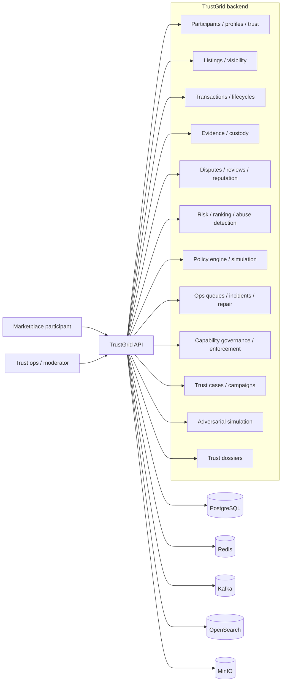
```mermaid
flowchart LR
    User[Marketplace participant]
    Moderator[Trust ops / moderator]
    API[TrustGrid API]

    subgraph TrustGrid[TrustGrid backend]
        Participants[Participants / profiles / trust]
        Listings[Listings / visibility]
        Transactions[Transactions / lifecycles]
        Evidence[Evidence / custody]
        Disputes[Disputes / reviews / reputation]
        Risk[Risk / ranking / abuse detection]
        Policy[Policy engine / simulation]
        Ops[Ops queues / incidents / repair]
        Governance[Capability governance / enforcement]
        Cases[Trust cases / campaigns]
        Adversarial[Adversarial simulation]
        Dossiers[Trust dossiers]
    end

    Postgres[(PostgreSQL)]
    Redis[(Redis)]
    Kafka[(Kafka)]
    OpenSearch[(OpenSearch)]
    MinIO[(MinIO)]

    User --> API
    Moderator --> API

    API --> Participants
    API --> Listings
    API --> Transactions
    API --> Evidence
    API --> Disputes
    API --> Risk
    API --> Policy
    API --> Ops
    API --> Governance
    API --> Cases
    API --> Adversarial
    API --> Dossiers

    API --> Postgres
    API --> Redis
    API --> Kafka
    API --> OpenSearch
    API --> MinIO
```

---

## Runtime architecture

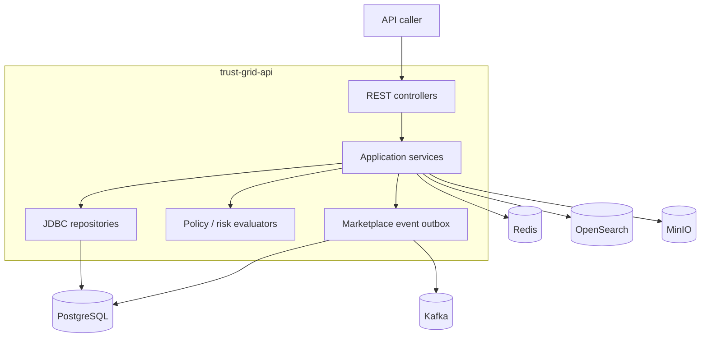
```mermaid
flowchart TD
    Client[API caller]

    subgraph App[trust-grid-api]
        Controllers[REST controllers]
        Services[Application services]
        Repositories[JDBC repositories]
        Policies[Policy / risk evaluators]
        Outbox[Marketplace event outbox]
    end

    DB[(PostgreSQL)]
    Cache[(Redis)]
    Search[(OpenSearch)]
    Events[(Kafka)]
    Objects[(MinIO)]

    Client --> Controllers
    Controllers --> Services
    Services --> Repositories
    Services --> Policies
    Services --> Outbox

    Repositories --> DB
    Services --> Cache
    Services --> Search
    Services --> Objects
    Outbox --> DB
    Outbox --> Events
```

---

## Core domain graph

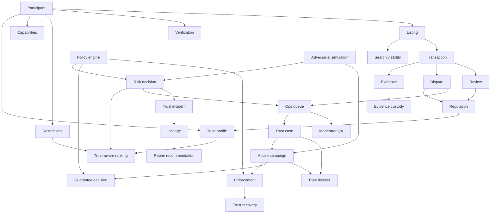
```mermaid
flowchart TD
    Participant[Participant]
    Profile[Trust profile]
    Capability[Capabilities]
    Restriction[Restrictions]
    Verification[Verification]
    Listing[Listing]
    Search[Search visibility]
    Transaction[Transaction]
    Evidence[Evidence]
    Custody[Evidence custody]
    Dispute[Dispute]
    Review[Review]
    Reputation[Reputation]
    Risk[Risk decision]
    Ranking[Trust-aware ranking]
    Ops[Ops queue]
    Policy[Policy engine]
    Incident[Trust incident]
    Lineage[Lineage]
    Repair[Repair recommendation]
    Case[Trust case]
    Campaign[Abuse campaign]
    Guarantee[Guarantee decision]
    Enforcement[Enforcement]
    Recovery[Trust recovery]
    QA[Moderator QA]
    Adversarial[Adversarial simulation]
    Dossier[Trust dossier]

    Participant --> Profile
    Participant --> Capability
    Participant --> Restriction
    Participant --> Verification
    Participant --> Listing
    Listing --> Search
    Listing --> Transaction
    Transaction --> Evidence
    Evidence --> Custody
    Transaction --> Dispute
    Transaction --> Review
    Dispute --> Reputation
    Review --> Reputation
    Reputation --> Profile
    Risk --> Ranking
    Profile --> Ranking
    Restriction --> Ranking
    Policy --> Risk
    Policy --> Guarantee
    Policy --> Enforcement
    Risk --> Ops
    Dispute --> Ops
    Ops --> Case
    Case --> Campaign
    Campaign --> Enforcement
    Campaign --> Guarantee
    Enforcement --> Recovery
    Ops --> QA
    Risk --> Incident
    Incident --> Lineage
    Lineage --> Repair
    Adversarial --> Risk
    Adversarial --> Campaign
    Case --> Dossier
    Campaign --> Dossier
```

---

## Feature coverage map

### 1. Foundation

TrustGrid includes a production-shaped backend foundation:

* Spring Boot API service
* Maven Wrapper
* PostgreSQL
* Flyway migrations
* Docker Compose runtime
* Redis
* Kafka
* OpenSearch
* MinIO
* Testcontainers-based integration testing
* system endpoints
* dependency probes
* error contract
* GitHub Actions workflow

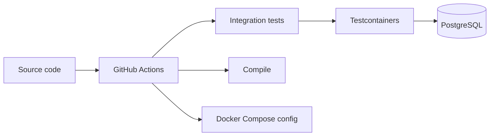
```mermaid
flowchart LR
    Source[Source code] --> CI[GitHub Actions]
    CI --> Tests[Integration tests]
    CI --> Compile[Compile]
    CI --> Compose[Docker Compose config]
    Tests --> Testcontainers[Testcontainers]
    Testcontainers --> Postgres[(PostgreSQL)]
```

---

### 2. Participant identity and trust foundation

TrustGrid treats marketplace participants as trust-bearing actors, not generic users.

It covers:

* participant creation
* profile slug uniqueness
* public marketplace profile
* profile completeness
* verification lifecycle
* account status lifecycle
* trust profile initialization
* trust tier
* risk level
* confidence
* transaction limits
* marketplace capabilities
* restrictions
* trust summary API
* participant audit timeline
* admin participant search

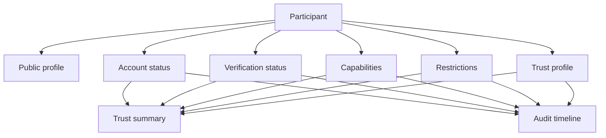
```mermaid
flowchart TD
    Participant[Participant]
    Profile[Public profile]
    Status[Account status]
    Verification[Verification status]
    Capability[Capabilities]
    Restriction[Restrictions]
    TrustProfile[Trust profile]
    Summary[Trust summary]
    Timeline[Audit timeline]

    Participant --> Profile
    Participant --> Status
    Participant --> Verification
    Participant --> Capability
    Participant --> Restriction
    Participant --> TrustProfile

    Status --> Summary
    Verification --> Summary
    Capability --> Summary
    Restriction --> Summary
    TrustProfile --> Summary

    Status --> Timeline
    Verification --> Timeline
    Capability --> Timeline
    Restriction --> Timeline
    TrustProfile --> Timeline
```

The system can answer:

* can this participant publish?
* can they accept work?
* are they restricted?
* do they need verification?
* are they hidden from search?
* what is their current trust tier?
* what changed in their trust history?

---

### 3. Marketplace listings and search eligibility

TrustGrid supports multiple listing types:

* service offers
* item listings
* errand requests
* shopping requests

It covers:

* category taxonomy
* category risk tiers
* base listing aggregate
* service offer fields
* item listing fields
* errand request fields
* shopping request fields
* draft lifecycle
* publish lifecycle
* high-risk listing review
* evidence requirements before publish
* listing edit rules
* duplicate listing detection
* listing moderation actions
* listing risk snapshots
* OpenSearch indexing
* search filters
* search visibility rules

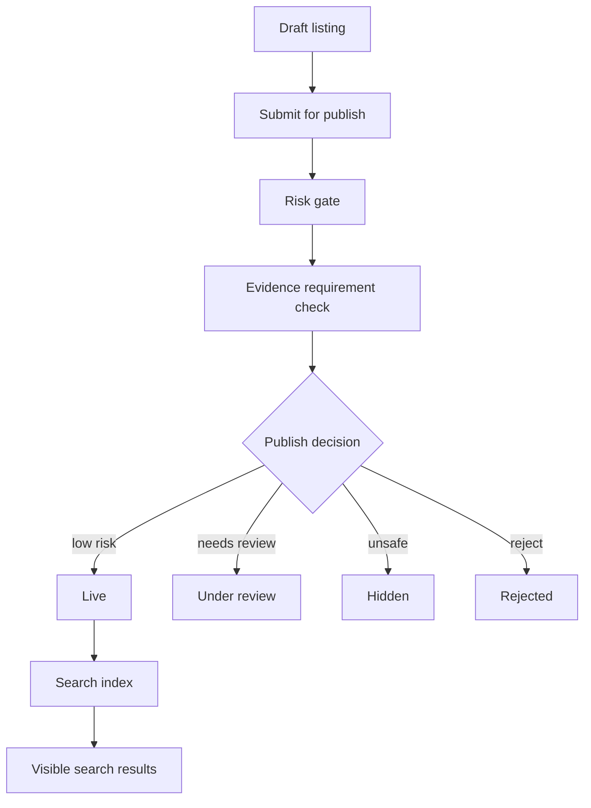
```mermaid
flowchart TD
    Draft[Draft listing]
    Submit[Submit for publish]
    RiskGate[Risk gate]
    EvidenceGate[Evidence requirement check]
    Decision{Publish decision}
    Live[Live]
    Review[Under review]
    Hidden[Hidden]
    Rejected[Rejected]
    Index[Search index]
    Results[Visible search results]

    Draft --> Submit
    Submit --> RiskGate
    RiskGate --> EvidenceGate
    EvidenceGate --> Decision
    Decision -->|low risk| Live
    Decision -->|needs review| Review
    Decision -->|unsafe| Hidden
    Decision -->|reject| Rejected
    Live --> Index
    Index --> Results
```

Search results are not only text matches.

They are trust-filtered marketplace candidates.

---

### 4. Transaction lifecycles

TrustGrid models mutation-heavy marketplace transaction flows.

It covers:

* service bookings
* item purchases
* errands
* shopping requests
* transaction idempotency
* request hash conflict detection
* accept/claim concurrency guards
* cancellation policies
* deadlines
* no-show reports
* completion claims
* buyer/requester confirmation
* transaction risk gates
* transaction audit timeline
* transaction invariant verifier
* transaction outbox events

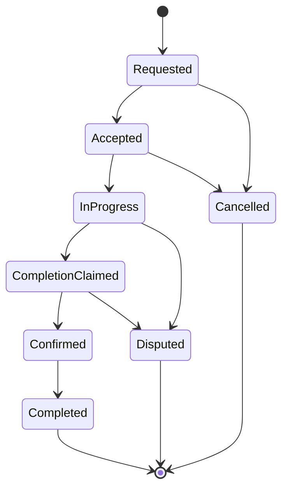
```mermaid
stateDiagram-v2
    [*] --> Requested
    Requested --> Accepted
    Accepted --> InProgress
    InProgress --> CompletionClaimed
    CompletionClaimed --> Confirmed
    Confirmed --> Completed
    Requested --> Cancelled
    Accepted --> Cancelled
    InProgress --> Disputed
    CompletionClaimed --> Disputed
    Completed --> [*]
    Cancelled --> [*]
    Disputed --> [*]
```

This proves state-machine design, idempotent mutations, concurrency protection, and auditability.

---

### 5. Evidence, disputes, and reputation

TrustGrid includes the trust backbone required for marketplace disagreement and recovery.

It covers:

* evidence metadata
* evidence types
* evidence requirements
* evidence bundles
* dispute creation
* dispute lifecycle
* dispute statements
* evidence deadlines
* dispute outcomes
* dispute resolution
* dispute trust impact
* review eligibility
* multidimensional reviews
* review confidence weighting
* reputation calculation
* trust tier transitions
* reputation snapshots
* recalculation events

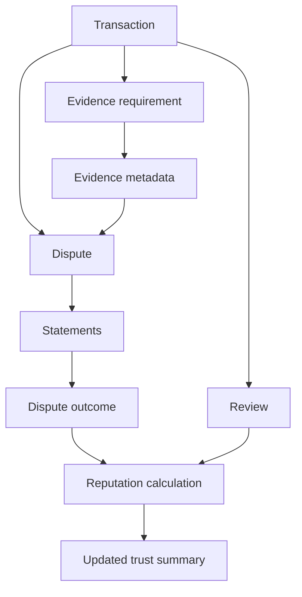
```mermaid
flowchart TD
    Tx[Transaction]
    EvidenceReq[Evidence requirement]
    Evidence[Evidence metadata]
    Dispute[Dispute]
    Statements[Statements]
    Outcome[Dispute outcome]
    Review[Review]
    Reputation[Reputation calculation]
    TrustSummary[Updated trust summary]

    Tx --> EvidenceReq
    EvidenceReq --> Evidence
    Tx --> Dispute
    Evidence --> Dispute
    Dispute --> Statements
    Statements --> Outcome
    Outcome --> Reputation
    Tx --> Review
    Review --> Reputation
    Reputation --> TrustSummary
```

This lets the system explain:

* which evidence was required
* which evidence was missing
* why a dispute was resolved
* how the dispute affected reputation
* how reviews contributed to trust

---

### 6. Fraud/risk rules and trust-aware ranking

TrustGrid includes deterministic, explainable risk logic.

It covers:

* new-user trust ramp
* value limits
* verification boost
* participant risk rules
* listing risk rules
* transaction risk rules
* evidence risk rules
* off-platform payment/contact risk
* privacy-safe synthetic signals
* automatic risk actions
* risk explanation API
* trust-aware ranking engine
* ranking reasons
* ranking policies
* ranking decision logs
* ranking replay

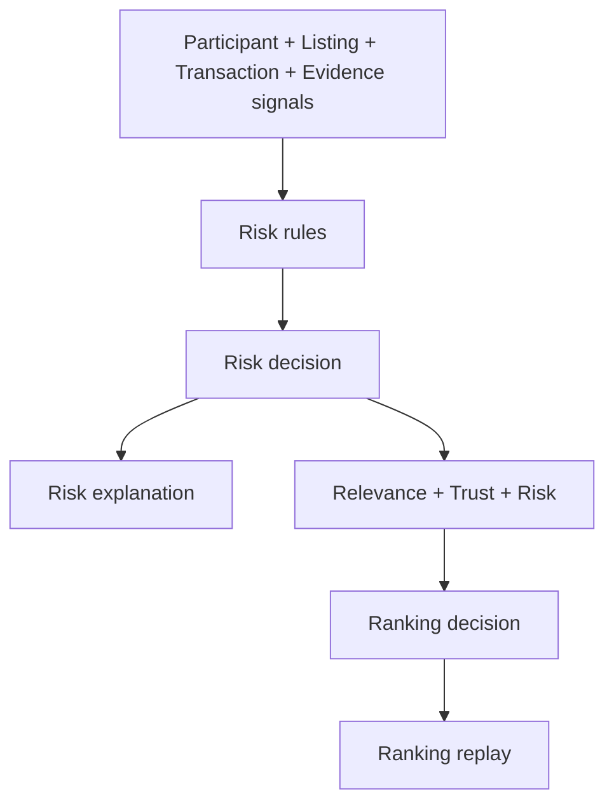
```mermaid
flowchart TD
    Inputs[Participant + Listing + Transaction + Evidence signals]
    Rules[Risk rules]
    RiskDecision[Risk decision]
    Explanation[Risk explanation]
    RankingInputs[Relevance + Trust + Risk]
    RankingDecision[Ranking decision]
    Replay[Ranking replay]

    Inputs --> Rules
    Rules --> RiskDecision
    RiskDecision --> Explanation
    RiskDecision --> RankingInputs
    RankingInputs --> RankingDecision
    RankingDecision --> Replay
```

TrustGrid does not simply score users.

It records decision-ready safety judgments with explanations and snapshots.

---

### 7. Fake-review and abuse graph detection

TrustGrid models review abuse as a graph problem.

It covers:

* review graph edges
* reciprocal review detection
* review ring detection
* low-value transaction abuse
* similar review text detection
* review burst detection
* suspicious cluster detection
* review weight suppression
* trust graph risk API

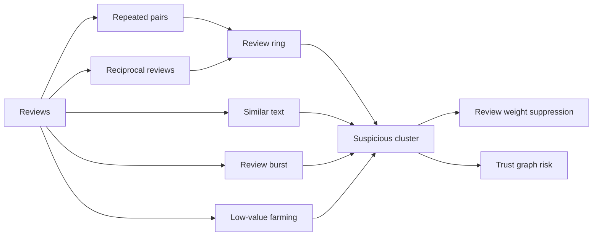
```mermaid
flowchart LR
    Reviews[Reviews]
    Pairs[Repeated pairs]
    Reciprocal[Reciprocal reviews]
    Ring[Review ring]
    Text[Similar text]
    Burst[Review burst]
    LowValue[Low-value farming]
    Cluster[Suspicious cluster]
    Suppression[Review weight suppression]
    Risk[Trust graph risk]

    Reviews --> Pairs
    Reviews --> Reciprocal
    Reviews --> Text
    Reviews --> Burst
    Reviews --> LowValue
    Pairs --> Ring
    Reciprocal --> Ring
    Ring --> Cluster
    Text --> Cluster
    Burst --> Cluster
    LowValue --> Cluster
    Cluster --> Suppression
    Cluster --> Risk
```

This is one of the strongest trust-and-safety features because it goes beyond simple ratings.

---

### 8. Operations, moderation, and payment-boundary workflows

TrustGrid includes internal safety operations.

It covers:

* ops queues
* high-risk listings queue
* open disputes queue
* suspicious accounts queue
* fake review clusters queue
* evidence missing queue
* repeated cancellations queue
* moderator actions
* moderator audit log
* manual review workflow
* safety escalation workflow
* account restriction workflow
* payment-boundary states
* funds release requested events
* refund requested events
* payout hold requested events

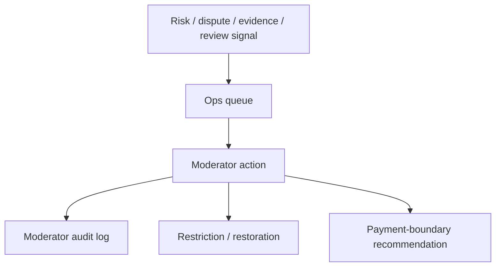
```mermaid
flowchart TD
    Signal[Risk / dispute / evidence / review signal]
    Queue[Ops queue]
    Moderator[Moderator action]
    Audit[Moderator audit log]
    Restriction[Restriction / restoration]
    Boundary[Payment-boundary recommendation]

    Signal --> Queue
    Queue --> Moderator
    Moderator --> Audit
    Moderator --> Restriction
    Moderator --> Boundary
```

TrustGrid does not execute payment movement.

It only recommends or emits marketplace trust outcomes that a separate financial system would handle.

---

### 9. Analytics, replay, rebuild, and consistency

TrustGrid includes production-shaped control-plane behavior.

It covers:

* analytics tables
* marketplace event analytics
* risk decision analytics
* dispute analytics
* ranking analytics
* trust metrics
* fraud metrics
* marketplace health metrics
* search/ranking analytics
* dispute analytics
* reputation drift detection
* reputation rebuild
* search index rebuild
* evidence consistency verification
* outbox replay
* audit timeline replay
* seeded scale generation
* outage/fallback behavior

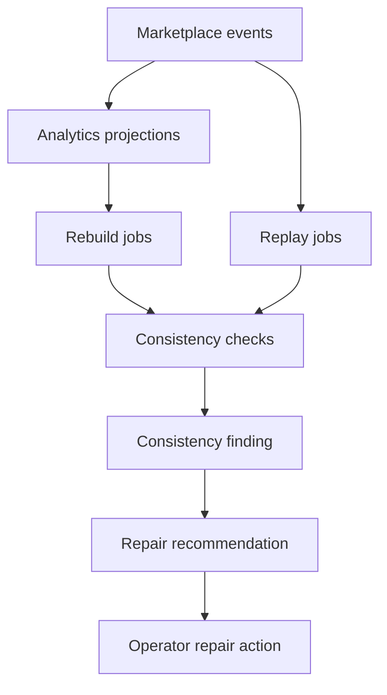
```mermaid
flowchart TD
    Events[Marketplace events]
    Analytics[Analytics projections]
    Rebuild[Rebuild jobs]
    Replay[Replay jobs]
    Consistency[Consistency checks]
    Finding[Consistency finding]
    Repair[Repair recommendation]
    Operator[Operator repair action]

    Events --> Analytics
    Events --> Replay
    Analytics --> Rebuild
    Rebuild --> Consistency
    Replay --> Consistency
    Consistency --> Finding
    Finding --> Repair
    Repair --> Operator
```

This is a core staff-level theme: the system can detect, explain, and repair derived-state drift.

---

### 10. Policy engine and simulation

TrustGrid includes a deterministic policy layer.

It covers:

* risk policy versioning
* reputation policy versioning
* ranking policy versioning
* dispute policy versioning
* restriction policy versioning
* policy simulation
* shadow risk decisions
* counterfactual ranking simulation
* dispute decision simulation
* abuse campaign summaries
* policy approval
* policy exceptions
* exception audit trail
* blast-radius preview
* policy rollback
* policy decision explainability

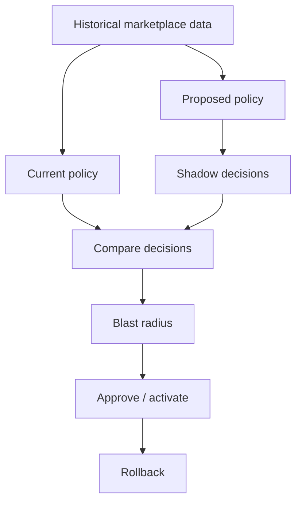
```mermaid
flowchart TD
    Current[Current policy]
    Proposed[Proposed policy]
    Historical[Historical marketplace data]
    Shadow[Shadow decisions]
    Compare[Compare decisions]
    Impact[Blast radius]
    Approve[Approve / activate]
    Rollback[Rollback]

    Historical --> Current
    Historical --> Proposed
    Proposed --> Shadow
    Current --> Compare
    Shadow --> Compare
    Compare --> Impact
    Impact --> Approve
    Approve --> Rollback
```

The key question this supports:

> What would happen if we changed this trust policy?

---

### 11. Incidents, lineage, explainability, and repair

TrustGrid includes operator-grade safety visibility.

It covers:

* trust telemetry
* SLO definitions
* moderation backlog monitor
* dispute backlog monitor
* risk spike detector
* review abuse spike detector
* trust score spike detector
* search suppression monitor
* incident model
* incident timeline
* incident impact summary
* incident evidence bundle
* alert-style records
* ops dashboard aggregate
* incident replay
* trust score lineage
* review contribution lineage
* dispute contribution lineage
* risk contribution lineage
* moderation contribution lineage
* ranking lineage
* policy lineage
* explanation APIs
* consistency verification
* data repair recommendations
* operator repair actions

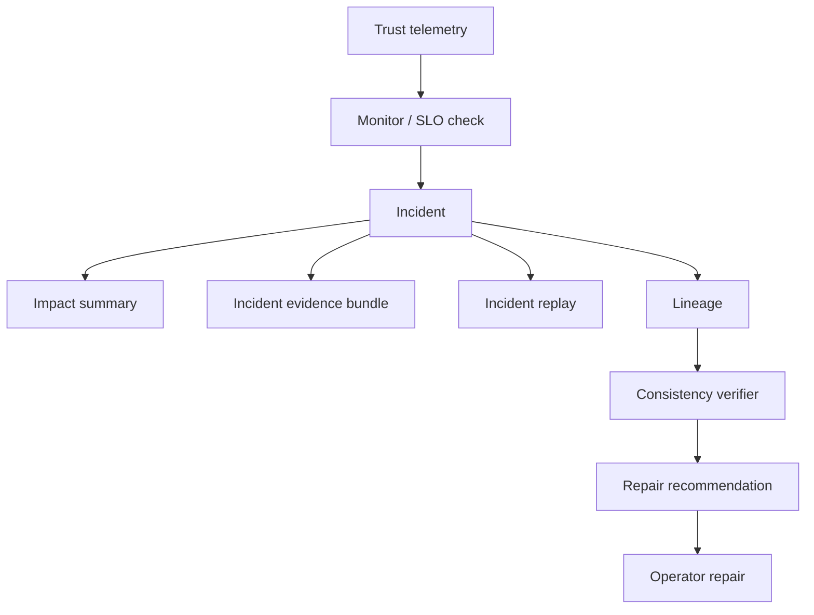
```mermaid
flowchart TD
    Telemetry[Trust telemetry]
    Monitor[Monitor / SLO check]
    Incident[Incident]
    Impact[Impact summary]
    EvidenceBundle[Incident evidence bundle]
    Replay[Incident replay]
    Lineage[Lineage]
    Consistency[Consistency verifier]
    Repair[Repair recommendation]
    Operator[Operator repair]

    Telemetry --> Monitor
    Monitor --> Incident
    Incident --> Impact
    Incident --> EvidenceBundle
    Incident --> Replay
    Incident --> Lineage
    Lineage --> Consistency
    Consistency --> Repair
    Repair --> Operator
```

This gives the backend a strong operational story.

---

### 12. Capability governance and break-glass

TrustGrid models marketplace actions as capability decisions.

It covers:

* action policy model
* capability simulation API
* deny reasons
* next-step recommendations
* temporary capability grants
* break-glass moderator action
* capability expiry
* capability governance timeline
* capability decision replay
* capability blast-radius preview
* audit bundle
* action eligibility dashboard
* capability consistency checks
* repair recommendations

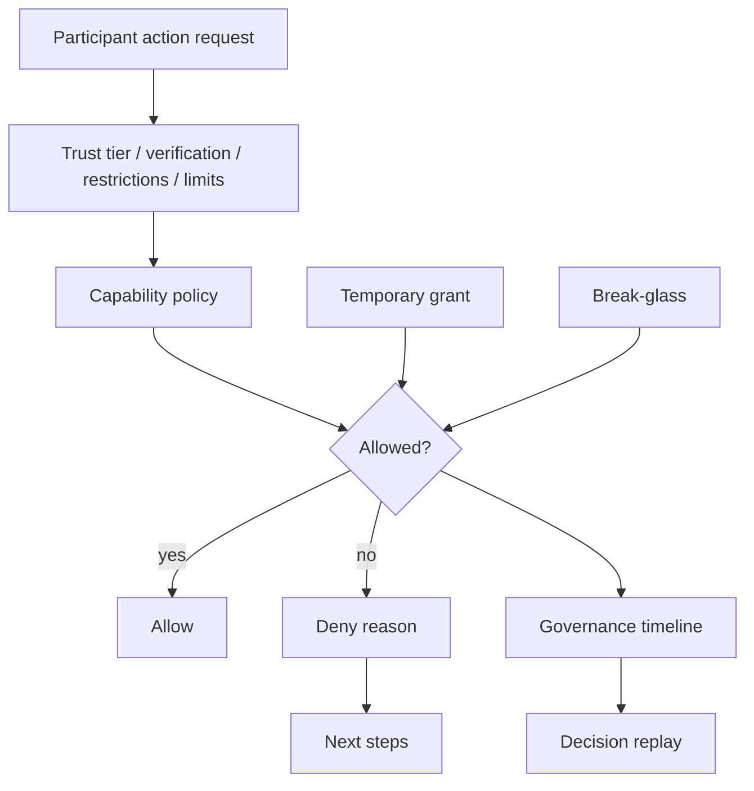
```mermaid
flowchart TD
    Request[Participant action request]
    Inputs[Trust tier / verification / restrictions / limits]
    Policy[Capability policy]
    Decision{Allowed?}
    Allow[Allow]
    Deny[Deny reason]
    NextSteps[Next steps]
    Grant[Temporary grant]
    BreakGlass[Break-glass]
    Timeline[Governance timeline]
    Replay[Decision replay]

    Request --> Inputs
    Inputs --> Policy
    Policy --> Decision
    Grant --> Decision
    BreakGlass --> Decision
    Decision -->|yes| Allow
    Decision -->|no| Deny
    Deny --> NextSteps
    Decision --> Timeline
    Timeline --> Replay
```

This answers:

* why was the action denied?
* what can the participant do next?
* was the decision deterministic?
* what happens if policy changes?
* who granted an override?

---

### 13. Trust cases and campaign containment

TrustGrid supports full trust case workflows.

It covers:

* trust case aggregate
* case target links
* case merge/split
* target movement/copying
* case priority and SLA
* case assignment
* playbooks
* evidence bundles
* action recommendations
* case timeline
* case replay
* case metrics
* campaign graph
* campaign blast-radius preview
* containment simulation
* containment approval
* containment execution
* containment reversal
* reversal conflict handling

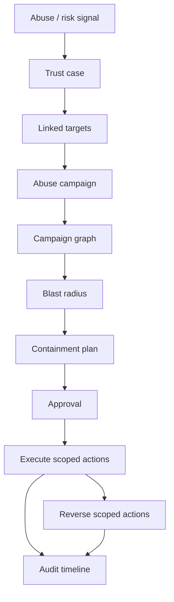
```mermaid
flowchart TD
    Signal[Abuse / risk signal]
    Case[Trust case]
    Targets[Linked targets]
    Campaign[Abuse campaign]
    Graph[Campaign graph]
    Blast[Blast radius]
    Plan[Containment plan]
    Approval[Approval]
    Execute[Execute scoped actions]
    Reverse[Reverse scoped actions]
    Timeline[Audit timeline]

    Signal --> Case
    Case --> Targets
    Targets --> Campaign
    Campaign --> Graph
    Graph --> Blast
    Blast --> Plan
    Plan --> Approval
    Approval --> Execute
    Execute --> Reverse
    Execute --> Timeline
    Reverse --> Timeline
```

Containment actions can include:

* opening a trust case
* hiding a listing
* restricting capabilities
* requiring verification
* suppressing review weight
* creating ops queue items
* escalating disputes
* requesting evidence
* requesting payout hold boundary events
* requesting guarantee review

---

### 14. Evidence chain-of-custody

TrustGrid models evidence as auditable metadata.

It covers:

* evidence versions
* custody events
* hash/provenance metadata
* access decisions
* redaction metadata
* retention metadata
* legal hold metadata
* disclosure bundles
* tamper checks
* consistency replay

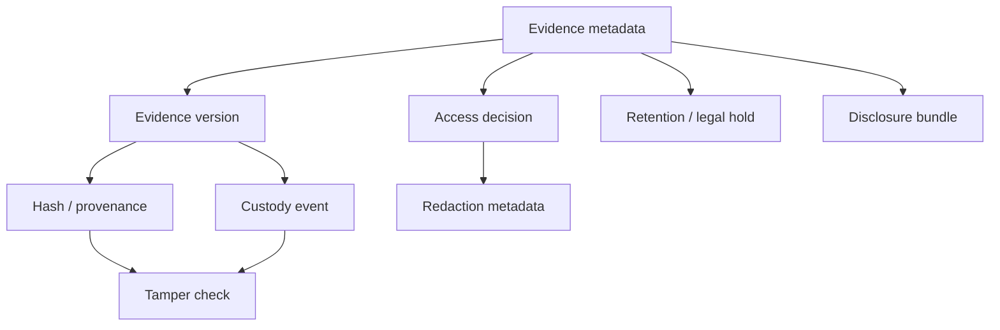
```mermaid
flowchart TD
    Evidence[Evidence metadata]
    Version[Evidence version]
    Hash[Hash / provenance]
    Custody[Custody event]
    Access[Access decision]
    Redaction[Redaction metadata]
    Retention[Retention / legal hold]
    Disclosure[Disclosure bundle]
    Tamper[Tamper check]

    Evidence --> Version
    Version --> Hash
    Version --> Custody
    Evidence --> Access
    Access --> Redaction
    Evidence --> Retention
    Evidence --> Disclosure
    Hash --> Tamper
    Custody --> Tamper
```

TrustGrid does not process real images, OCR, or media content.

It models the backend audit structure needed around evidence.

---

### 15. Marketplace guarantee controls

TrustGrid includes guarantee decision logic without money movement.

It covers:

* guarantee policies
* eligibility simulation
* deny reasons
* required evidence
* fraud exclusions
* dispute outcome integration
* risk/campaign/evidence inputs
* duplicate-safe payment-boundary recommendations
* guarantee audit timeline

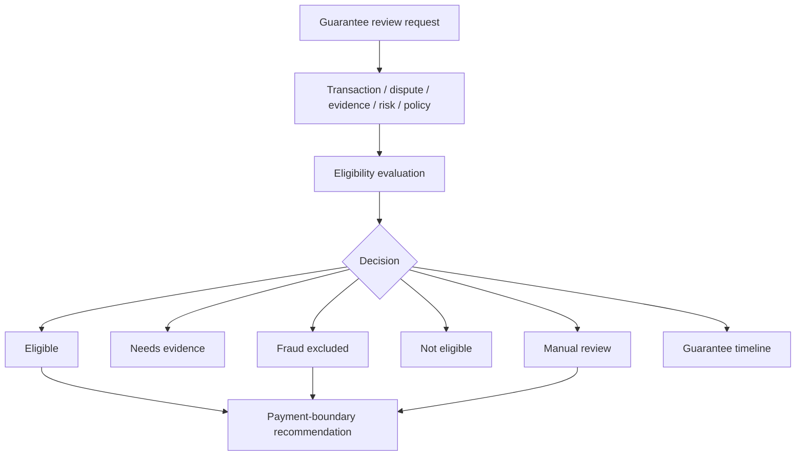
```mermaid
flowchart TD
    Request[Guarantee review request]
    Inputs[Transaction / dispute / evidence / risk / policy]
    Eligibility[Eligibility evaluation]
    Decision{Decision}
    Eligible[Eligible]
    NeedsEvidence[Needs evidence]
    FraudExcluded[Fraud excluded]
    NotEligible[Not eligible]
    Manual[Manual review]
    Boundary[Payment-boundary recommendation]
    Audit[Guarantee timeline]

    Request --> Inputs
    Inputs --> Eligibility
    Eligibility --> Decision
    Decision --> Eligible
    Decision --> NeedsEvidence
    Decision --> FraudExcluded
    Decision --> NotEligible
    Decision --> Manual
    Eligible --> Boundary
    FraudExcluded --> Boundary
    Manual --> Boundary
    Decision --> Audit
```

Possible recommendations:

* request refund
* request funds release
* request payout hold
* no payment-boundary action
* manual review

Again: TrustGrid does not execute money movement.

---

### 16. Enforcement, recovery, and moderator QA

TrustGrid includes internal safety controls.

It covers:

* enforcement ladder policies
* warnings
* cooldowns
* probation
* verification requirements
* evidence requirements
* capability restrictions
* listing hiding
* review suppression
* account suspension recommendations
* severe action approval
* approval consumption
* trust recovery plans
* recovery milestones
* capability restoration recommendations
* moderator QA reviews
* peer review
* action reversal
* case quality review

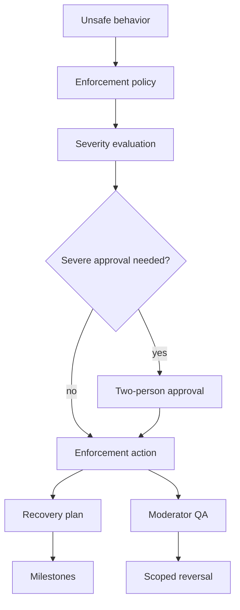
```mermaid
flowchart TD
    Signal[Unsafe behavior]
    Policy[Enforcement policy]
    Severity[Severity evaluation]
    Approval{Severe approval needed?}
    Approve[Two-person approval]
    Action[Enforcement action]
    Recovery[Recovery plan]
    Milestones[Milestones]
    Review[Moderator QA]
    Reversal[Scoped reversal]

    Signal --> Policy
    Policy --> Severity
    Severity --> Approval
    Approval -->|yes| Approve
    Approval -->|no| Action
    Approve --> Action
    Action --> Recovery
    Recovery --> Milestones
    Action --> Review
    Review --> Reversal
```

The system prevents silent restoration of closed, suspended, or severely restricted users.

---

### 17. Adversarial red-team simulation

TrustGrid includes deterministic synthetic abuse simulations.

It covers:

* adversarial scenario catalog
* synthetic attack runs
* fake review farming
* refund abuse
* evidence tampering
* off-platform payment pressure
* new-account high-value fraud
* collusive dispute manipulation
* guarantee abuse
* coordinated listing spam
* detection coverage matrix
* defense recommendations
* false-positive review workflow
* attack replay

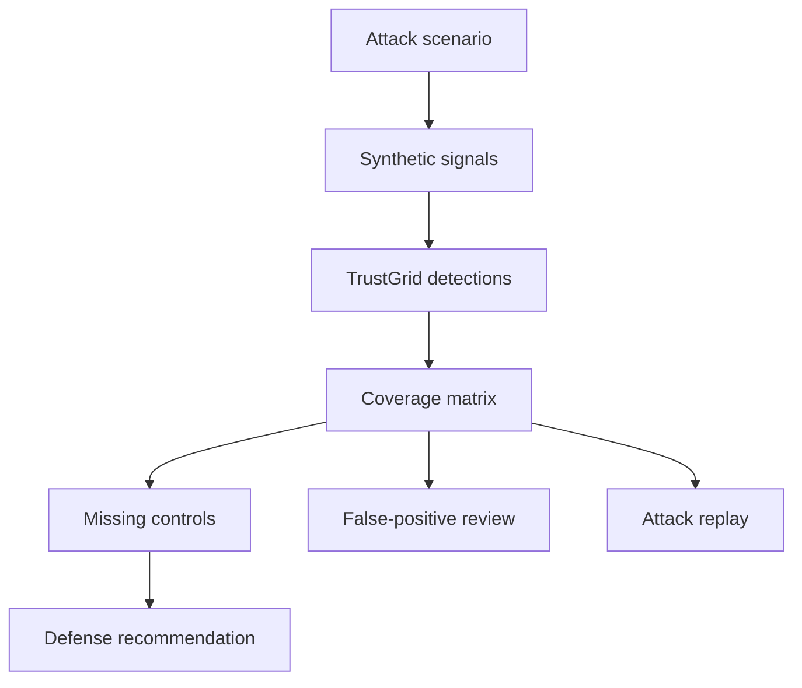
```mermaid
flowchart TD
    Scenario[Attack scenario]
    Seed[Synthetic signals]
    Detection[TrustGrid detections]
    Coverage[Coverage matrix]
    Gap[Missing controls]
    Defense[Defense recommendation]
    FalsePositive[False-positive review]
    Replay[Attack replay]

    Scenario --> Seed
    Seed --> Detection
    Detection --> Coverage
    Coverage --> Gap
    Gap --> Defense
    Coverage --> FalsePositive
    Coverage --> Replay
```

This gives the project a strong “red-team the backend” story without claiming real ML.

---

### 18. Trust dossiers and control-room aggregate

TrustGrid can aggregate trust context into dossiers.

It covers:

* participant dossier
* listing dossier
* transaction dossier
* dispute dossier
* campaign dossier
* trust control-room aggregate
* marketplace graph summary
* bounded scale seed runs

```mermaid
flowchart TD
    Target[Participant / listing / transaction / dispute / campaign]
    Trust[Trust summary]
    Risk[Risk decisions]
    Evidence[Evidence]
    Disputes[Disputes]
    Reviews[Reviews]
    Cases[Trust cases]
    Campaigns[Campaigns]
    Enforcement[Enforcement]
    Repairs[Findings / repairs]
    Dossier[Trust dossier]

    Target --> Trust
    Target --> Risk
    Target --> Evidence
    Target --> Disputes
    Target --> Reviews
    Target --> Cases
    Target --> Campaigns
    Target --> Enforcement
    Target --> Repairs
    Trust --> Dossier
    Risk --> Dossier
    Evidence --> Dossier
    Disputes --> Dossier
    Reviews --> Dossier
    Cases --> Dossier
    Campaigns --> Dossier
    Enforcement --> Dossier
    Repairs --> Dossier
```

Dossiers are scoped views, not global dumps.

---

## Main backend modules

TrustGrid is implemented as a modular monolith.

Each package owns a specific part of the trust-and-safety domain.

| Module                 | Responsibility                                                                  |
| ---------------------- | ------------------------------------------------------------------------------- |
| `system`               | Health, dependency probes, node/system info                                     |
| `participant`          | Participants, profiles, verification, capabilities, restrictions, trust summary |
| `category`             | Marketplace category taxonomy and risk tiers                                    |
| `listing`              | Listing lifecycle, publishing, moderation, risk snapshots                       |
| `search`               | Listing search, OpenSearch integration, visibility filtering                    |
| `transaction`          | Transaction lifecycles, idempotency, timelines, invariants                      |
| `evidence`             | Evidence metadata, requirements, bundles                                        |
| `dispute`              | Disputes, statements, outcomes, resolution                                      |
| `review`               | Review eligibility and multidimensional reviews                                 |
| `reputation`           | Reputation scoring, trust tiers, recalculation                                  |
| `risk`                 | Deterministic risk rules and explanations                                       |
| `ranking`              | Trust-aware ranking and replay                                                  |
| `reviewgraph`          | Review abuse graph and fake-review suppression                                  |
| `ops`                  | Ops queues, moderation, manual review workflows                                 |
| `paymentboundary`      | Refund/release/hold boundary recommendations                                    |
| `analytics`            | Trust, fraud, ranking, dispute, and health metrics                              |
| `rebuild`              | Rebuild/replay jobs for derived state                                           |
| `policy`               | Policy simulation, appeals, retention, shadow decisions                         |
| `policyengine`         | Deterministic policy engine, approvals, exceptions, rollback                    |
| `incident`             | Telemetry, monitors, incidents, alerts, replay                                  |
| `lineage`              | Trust score, ranking, policy, and contribution lineage                          |
| `consistency`          | Cross-domain consistency findings                                               |
| `repair`               | Repair recommendations and audited operator repair                              |
| `capabilitygovernance` | Capability simulation, grants, break-glass, replay, dashboard                   |
| `trustcase`            | Trust cases, targets, merge/split, replay, evidence bundles                     |
| `campaign`             | Campaign graph, containment, reversal                                           |
| `evidencecustody`      | Evidence versions, custody, retention, disclosure, tamper checks                |
| `guarantee`            | Guarantee policies, eligibility, boundary recommendations                       |
| `enforcement`          | Enforcement ladder, severe approvals, reversals                                 |
| `recovery`             | Trust recovery plans and milestones                                             |
| `moderatorqa`          | Moderator QA, peer review, case quality review                                  |
| `adversarial`          | Synthetic abuse scenarios, coverage, defense recommendations                    |
| `dossier`              | Trust dossiers, control-room aggregates, scale seed                             |

---

## Important backend patterns

### Idempotency

TrustGrid uses idempotency keys and deterministic request hashing for unsafe mutations.

This prevents duplicate API calls from creating duplicate transactions, decisions, or payment-boundary recommendations.

### Explicit state machines

Several domains use explicit lifecycle states:

* account status
* listing status
* transaction status
* dispute status
* policy status
* incident status
* case status
* containment plan status
* enforcement status
* recovery status

### Audit timelines

TrustGrid records timelines for participants, transactions, disputes, incidents, capability governance, trust cases, guarantee decisions, containment, and enforcement.

This makes the system explainable and replayable.

### Outbox-style events

Marketplace events are recorded with outbox-ready metadata:

* event type
* event key
* event status
* publish attempts
* published timestamp
* last error
* payload

This keeps domain mutations separate from event publication.

### Deterministic replay

Replay is used to explain and verify past decisions.

TrustGrid includes replay behavior around:

* ranking
* policy decisions
* incidents
* trust cases
* capability decisions
* audit timelines
* adversarial runs

### Consistency checks and repair recommendations

TrustGrid does not blindly auto-fix risky state.

It creates findings, repair recommendations, and audited operator repair actions.

### Scoped reversal

Containment and enforcement reversal are scoped to the original action.

The system avoids broad unsafe restoration.

### Payment-boundary discipline

TrustGrid can recommend payment-boundary actions, but it does not execute them.

This keeps marketplace trust decisions separate from financial execution.

---

## Test strategy

TrustGrid uses high-value integration tests rather than one tiny test per endpoint.

The tests prove:

* migrations apply cleanly
* application starts
* error contract works
* dependencies are visible
* participant trust lifecycle works
* listing risk gates work
* transaction idempotency works
* transaction invariants hold
* evidence/dispute/reputation flows work
* risk explanations are returned
* ranking replay is deterministic
* review abuse detection works
* policy simulation uses real state
* incidents and lineage are replayable
* consistency findings deduplicate
* repair actions require acknowledgement
* capability governance denies unsafe actions
* trust case split moves selected targets
* campaign containment executes requested actions
* containment reversal is scoped
* guarantee decisions are idempotent
* severe enforcement requires approval
* adversarial scenarios create coverage signals
* scale seed creates bounded synthetic data
* final capstone invariants hold

---

## CI pipeline

GitHub Actions runs:

* Maven wrapper proof
* foundation targeted tests
* participant targeted tests
* marketplace lifecycle targeted tests
* evidence/dispute/risk targeted tests
* control-plane proof tests
* policy engine tests
* operational trust tests
* capability governance tests
* trust-safety final capstone tests
* full backend tests
* backend compile
* Docker Compose config validation

---

## Local development

### Requirements

* Java 21
* Docker Desktop or Docker Engine
* Maven Wrapper from `apps/api`

### Check Maven Wrapper

```bash
cd apps/api
./mvnw -v
```

### Run backend tests

```bash
cd apps/api
./mvnw test
```

### Compile backend

```bash
cd apps/api
./mvnw -DskipTests compile
```

### Validate Docker Compose

```bash
docker compose -f infra/docker-compose/docker-compose.yml config
```

### Start local stack

```bash
docker compose -f infra/docker-compose/docker-compose.yml up -d --build
```

### Health checks

```bash
curl http://localhost:8080/actuator/health
curl http://localhost:8080/actuator/health/readiness
curl http://localhost:8080/api/v1/system/ping
curl http://localhost:8080/api/v1/system/node
curl http://localhost:8080/api/v1/system/dependencies
```

### Stop local stack

```bash
docker compose -f infra/docker-compose/docker-compose.yml down -v
```

---

## Docker Compose services

The local runtime includes:

* `trustgrid-api`
* `trustgrid-postgres`
* `trustgrid-redis`
* `trustgrid-kafka`
* `trustgrid-opensearch`
* `trustgrid-minio`

---

## Demo story

A strong TrustGrid demo can show this sequence:

1. Create participants.
2. Grant marketplace capabilities.
3. Create profiles and trust summaries.
4. Create service/item/errand/shopping listings.
5. Publish low-risk listings.
6. Push high-risk listings into review.
7. Start marketplace transactions.
8. Apply transaction risk gates.
9. Add evidence requirements.
10. Upload evidence metadata.
11. Create evidence custody events.
12. Open a dispute.
13. Submit participant statements.
14. Resolve the dispute.
15. Recalculate reputation.
16. Run risk decisions.
17. Run trust-aware ranking.
18. Detect review abuse.
19. Create ops queue items.
20. Simulate a policy change.
21. Open a trust case.
22. Link targets to the case.
23. Split selected targets into another case.
24. Create an abuse campaign.
25. Preview campaign blast radius.
26. Build containment plan.
27. Approve containment.
28. Execute scoped containment actions.
29. Reverse containment with risk acknowledgement.
30. Run guarantee eligibility simulation.
31. Emit duplicate-safe payment-boundary recommendation.
32. Execute severe enforcement with approval.
33. Create recovery plan.
34. Run adversarial scenario.
35. Generate trust dossier.
36. Run consistency checks.
37. Generate repair recommendations.

---

## What this project proves technically

TrustGrid demonstrates:

* modular-monolith backend design
* explicit domain boundaries
* complex state machines
* idempotent unsafe mutations
* audit timeline modeling
* outbox-style event boundaries
* deterministic replay
* trust/risk explainability
* policy versioning and simulation
* consistency verification
* safe repair workflows
* scoped containment and reversal
* evidence custody and tamper detection
* approval-gated enforcement
* adversarial scenario testing
* high-value integration testing
* Docker Compose runtime proof

---

## Strong interview stories

### 1. Trust-bearing participants are not generic users

Participants have profiles, verification, capabilities, restrictions, trust tier, risk level, confidence, transaction limits, and timelines.

### 2. Listing visibility is a trust decision

Search results are filtered by listing state, owner state, risk, restrictions, moderation, and trust constraints.

### 3. Transactions need idempotency and lifecycle invariants

Accepting, cancelling, completing, and confirming transactions are unsafe mutations that need idempotency and state validation.

### 4. Evidence only matters if custody is preserved

TrustGrid models evidence versions, custody events, provenance, retention, legal hold, disclosure bundles, and tamper checks.

### 5. Disputes need timelines, not just statuses

Disputes include statements, evidence, deadlines, outcomes, trust impact, and audit history.

### 6. Reputation must be explainable

Trust scores are derived from reviews, completions, cancellations, no-shows, disputes, evidence reliability, and profile quality.

### 7. Risk decisions need snapshots and reasons

TrustGrid stores decision reasons and snapshots so decisions can be explained and replayed.

### 8. Ranking should explain trust suppression

Trust-aware ranking records why listings appear, why they are suppressed, and how trust/risk affects order.

### 9. Operator workflows are product features

Ops queues, incidents, moderator actions, repair recommendations, and QA workflows are part of the backend product.

### 10. Policy simulation prevents blind safety changes

TrustGrid can compare current and proposed policies before enforcement.

### 11. Containment must be scoped and reversible

Campaign containment is approved, audited, executed with before/after snapshots, and reversed safely.

### 12. Payment-boundary events are not money movement

TrustGrid recommends marketplace outcomes; it does not own financial execution.

### 13. Adversarial simulations reveal control gaps

Synthetic attacks create coverage matrices and defense recommendations.

### 14. Stop lines prevent feature creep

TrustGrid is intentionally backend-feature complete. Further work should focus on polish, demos, and learning labs.

---

## Non-overlap boundaries

TrustGrid owns marketplace trust and safety.

It does not own:

* URL-routing or link-serving infrastructure
* financial execution or accounting truth
* recommendation-platform experimentation as the primary product
* realtime collaborative editing/state convergence
* software release/deployment orchestration

TrustGrid reuses common backend patterns such as idempotency, outbox events, replay, repair, consistency checks, and audit logs, but applies them specifically to marketplace trust-and-safety decisions.

---

## Known limitations

TrustGrid is a portfolio/backend learning project, not a production SaaS.

Current limitations:

* no frontend/admin UI
* no production auth/RBAC
* no real payment processor
* no financial execution
* no real KYC provider
* no real ML moderation
* no production deployment/IaC
* bounded synthetic scale proof rather than true load testing
* deterministic rules instead of ML models
* local Docker Compose instead of cloud runtime

These are intentional boundaries.

---

## Recommended future work

Do not add more marketplace trust/safety feature families.

Recommended future work:

1. Split the final orchestration service into smaller focused services.
2. Add OpenAPI/API catalog.
3. Add architecture docs and ADRs.
4. Add a guided demo walkthrough.
5. Add interview story pack.
6. Create separate tiny learning labs:

   * Postgres locking lab
   * JVM performance lab
   * Kafka failure lab
   * Kubernetes runtime lab

Avoid adding more TrustGrid domain features unless a real correctness gap is found.

---

## Project status

TrustGrid backend technical feature work is complete for the capstone.

The project demonstrates a full marketplace trust-and-safety backend control plane with:

* trust profiles
* capabilities
* listings
* transactions
* evidence
* disputes
* reputation
* risk
* ranking
* review abuse detection
* operations
* policies
* incidents
* lineage
* repair
* capability governance
* trust cases
* campaign containment
* evidence custody
* guarantees
* enforcement
* recovery
* moderator QA
* adversarial simulation
* dossiers
* final invariants

Remaining work should focus on:

* code-quality polish
* architecture documentation
* demo packaging
* interview preparation
* isolated learning labs outside this repository
